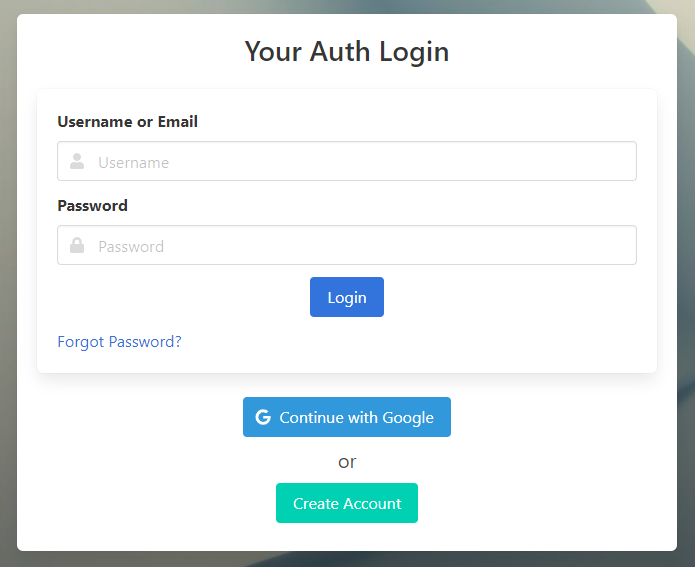

# simple-auth


Simple-auth is a lightweight, whitelabeled, authentication solution targeting small and medium sites. 
It allows users to sign-up with a UI, offering various providers.  Then, via various authenticators, allows
3rd party appliances to authenticate with it.

[Read the Documentation](https://simple-auth.surge.sh)

View examples in /docs/examples



# Running Simple Auth

[Read Quickstart](https://simple-auth.surge.sh/quickstart.html)

# Development

## Dev-Mode

Two commands need to be run to dev:
```sh
# Runs frontend code in watch mode
npm run dev

# Runs the server
make rundev
```

## Building

```
make
```

OR with docker

```
docker build .
```

### Build Tags

Some parts of the build are optional & configurable.

You can specify the following tags on a `go build`

* `box` Includes any boxed files as part of `go generate ./...` in the resulting binary
* `prometheus` Compiles a prometheus endpoint into the app
* `swagger` Compiles the swagger doc and endpoint into the app


# License

Copyright (c) 2020 Christopher LaPointe

Permission is hereby granted, free of charge, to any person obtaining a copy
of this software and associated documentation files (the "Software"), to deal
in the Software without restriction, including without limitation the rights
to use, copy, modify, merge, publish, distribute, sublicense, and/or sell
copies of the Software, and to permit persons to whom the Software is
furnished to do so, subject to the following conditions:

The above copyright notice and this permission notice shall be included in all
copies or substantial portions of the Software.

THE SOFTWARE IS PROVIDED "AS IS", WITHOUT WARRANTY OF ANY KIND, EXPRESS OR
IMPLIED, INCLUDING BUT NOT LIMITED TO THE WARRANTIES OF MERCHANTABILITY,
FITNESS FOR A PARTICULAR PURPOSE AND NONINFRINGEMENT. IN NO EVENT SHALL THE
AUTHORS OR COPYRIGHT HOLDERS BE LIABLE FOR ANY CLAIM, DAMAGES OR OTHER
LIABILITY, WHETHER IN AN ACTION OF CONTRACT, TORT OR OTHERWISE, ARISING FROM,
OUT OF OR IN CONNECTION WITH THE SOFTWARE OR THE USE OR OTHER DEALINGS IN THE
SOFTWARE.

