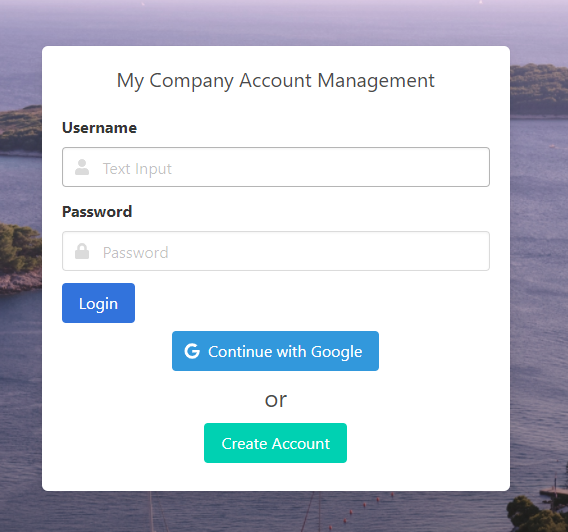

# Simple Auth

*Simple-Auth* is a designed to be an easy way to manage users in a multi-usecase scenario.  Unlike large complex solutions, it aims
to provide **simple login and user-management to a small or medium site**.  It doesn't try to replace global authentication providers
or enterprise user management (kerberos, active directory, etc...)

::: tip
Looking to get started? See [Quickstart](quickstart)
:::

**Common use-cases include:**

- Stand-alone user management (signup), and credential validation via API
- Reverse proxy to downstream service blocked by login (gateway)
- Per-request vouching (eg. for NGINX `auth_request` to act as a validator for login), to act as an authentication portal
- Same-domain/subdomain login provider via cookie validation
- Various API implementations to authenticate a user (Simple username/password, OIDC, etc)

**And it providers the common functionality:**

- "Simple" credentials (Username, password, and optionally TOTP/2FA)
- OpenID Connect Login (OIDC) eg. Google Auth
- Welcome email, and optional user email verification
- Forgot/lost password
- Login/access-attempt auditing
- REST API to all underlying functionality

## Concepts

### Objects

At the root of the object representation sits the "Account". It is associated with
a unique email.  By itself, an account does not give access to login, it needs
an authentication object associated with it.

<mermaid>
graph TD
A[Account]
A --> B[Local Auth]
B --> B2[TOTP/2FA]
A --> C[OIDC Provider]
A --> D{Audit Log}
</mermaid>

### Layers

By default, simple-auth is split into three layers:

1. **Login Providers**: The mechanisms that allow creating an account object
1. **Authentication Providers (API)**: How dowstream apps can query
1. **Access Layer**: How web applications can authenticate with simple-auth

You can find more information on all three layers on the left.

## Login Providers

Login providers are how the user logs into simple-auth.  For example, they could be a "Local" account (Username and password) or OpenID Connect (OAuth 2)

## Authentication Providers

Authentication providers are generally APIs where a downstream service can authenticate against *simple-auth* via API/redirect requests.

## Access Layer

### Cookie

**Login-mode** is when *simple-auth* acts as a login-provider, and a downstream service validates the user via signed cookie or other API mechanism

### Gateway
**Gateway-mode** is when *simple-auth* sits between the user and what they're trying to access as a portal

# Next Steps

Try heading over to [Quickstart](quickstart) and giving it a try!
